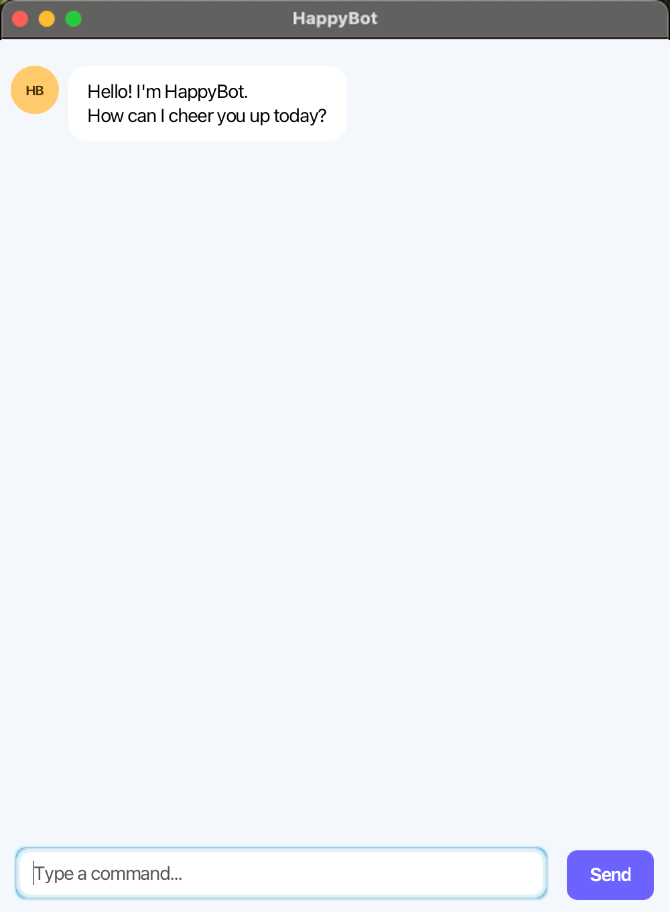
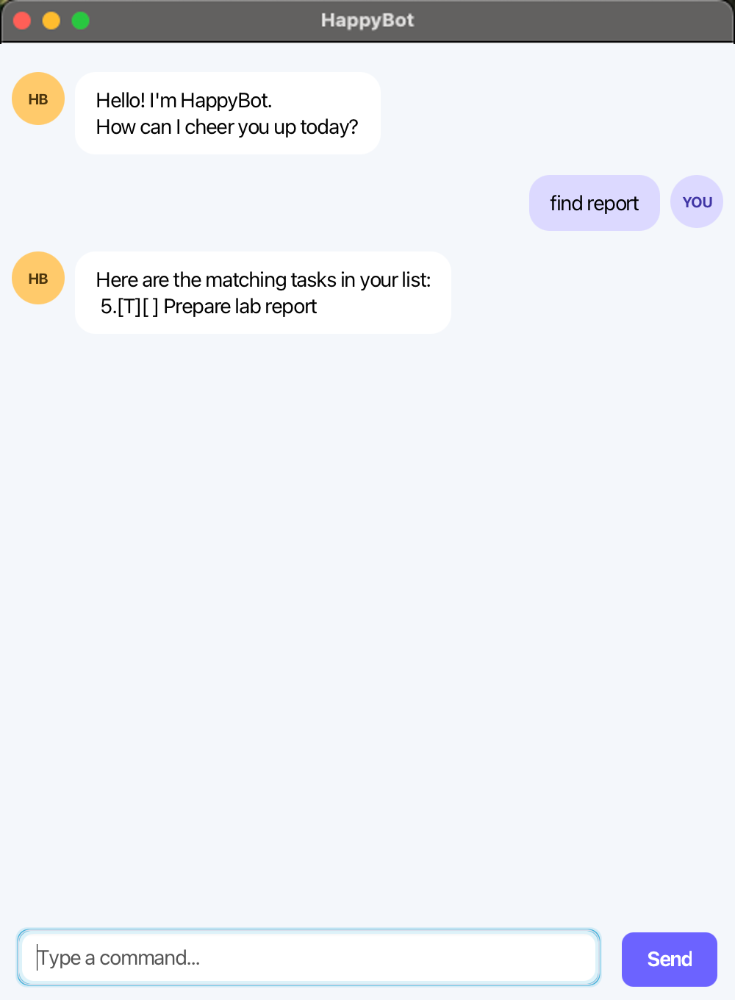
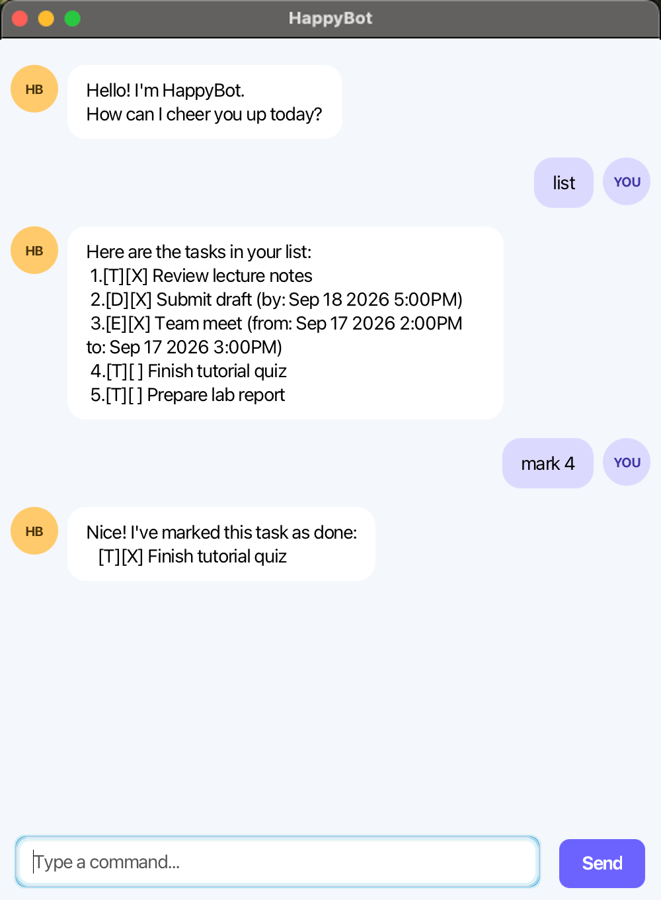
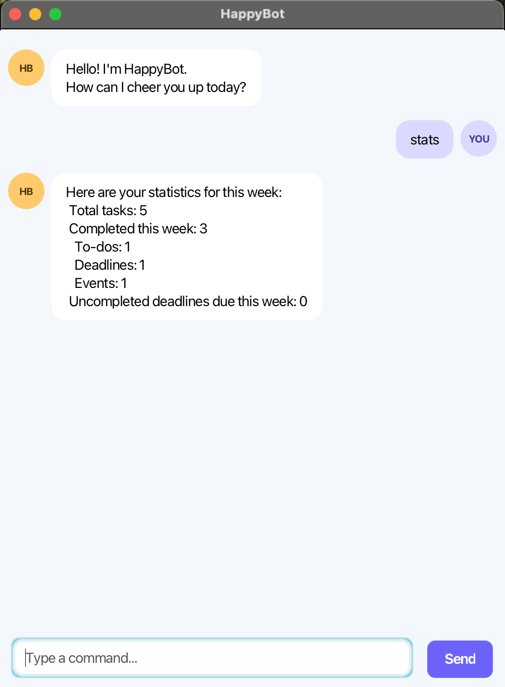

# HappyBot User Guide

HappyBot is a task manager for students who want a simple place to plan work and track
their progress. Use its chat-style commands to add to-dos, deadlines, and events; review what is
coming up; and see what you completed this week.

## Quick start

1. Ensure that Java 25 is installed. In a terminal, run `java -version` to check that it reports
   version 25.
2. Download `happybot.jar` from the [latest HappyBot release](https://github.com/EL-NAIT/ip/releases/latest).
   Under **Assets**, select `happybot.jar`.
3. Copy `happybot.jar` to the folder where you want HappyBot to keep its data.
4. Open a terminal.
5. Change to the folder containing the JAR file, then start HappyBot:

   ```sh
   cd path/to/your/folder
   java -jar happybot.jar
   ```

   HappyBot opens with its welcome message:

   

6. Type a command in the command box and press Enter or select **Send**. Try these commands in
   order:

   - `todo Review lecture notes` adds a to-do.
   - `deadline Submit draft /by TOMORROW 1700` adds a deadline.
   - `event Team meeting /from TOMORROW 1400 /to TOMORROW 1530` adds an event.
   - `list` shows all tasks.
   - `stats` shows your progress for the week.
   - `delete 1` removes task 1 after you have listed your tasks.

   (Replace `TOMORROW` with the current date plus one day. HappyBot rejects a deadline or an
   event whose end date is before the current date.)
7. Refer to the [Commands and Features](#commands-and-features) section below for details of
   each command.

## Commands and Features

### Command format

- Type one lowercase command per line.
- Replace words in `UPPER_CASE` with your own details. For example, replace `DESCRIPTION` in
  `todo DESCRIPTION` with `Review lecture notes`.
- HappyBot accepts extra spaces and tabs between command parts, but task descriptions are stored
  with one space between words.
- Task descriptions cannot contain the `|` character.
- `DATE` is either `yyyy-MM-dd` or `d/M/yyyy`, such as `2026-11-17` or `17/11/2026`.
- `[T]`, `[D]`, and `[E]` identify a to-do, deadline, and event. `[X]` means complete; `[ ]`
  means incomplete.

Start by adding the work you need to remember. HappyBot rejects an exact duplicate task, so you
do not accidentally add the same work twice.

### Add a to-do: `todo`

Use a to-do for work without a specific date.

**Format:** `todo DESCRIPTION`

**Example:**

```text
todo Review lecture notes
```

### Add a deadline: `deadline`

Use a deadline for work due on a particular date.

**Format:** `deadline DESCRIPTION /by DATE [TIME]`

- `TIME` is optional and uses 24-hour `HHmm` format, such as `1700`. If you omit it, HappyBot
  stores the deadline at `0000` (12:00 AM). When adding a deadline without a time, HappyBot
  checks only that its date is today or later; include a time when the exact deadline matters.
- HappyBot rejects a deadline that is already due. A deadline with a time must have a due
  date and time after the current date and time, while a deadline without one must have a date
  that is today or later.

**Examples:**

```text
deadline Submit draft /by 2026-11-17 1700
deadline Pay library fine /by 17/11/2026
```

### Add an event: `event`

Use an event for something that has a start and end time, such as a meeting or class. The end time
must be later than the start time.

**Format:** `event DESCRIPTION /from DATE [TIME] /to DATE [TIME]`

- Each optional `TIME` uses 24-hour `HHmm` format, such as `1400` or `1530`. If you omit one,
  HappyBot uses `0000` (12:00 AM) at the beginning of that date. For a same-date event, ensure
  that its start time is earlier than its end time; omitting both times gives equal times and is
  rejected.
- HappyBot rejects an event that has already ended. An explicit end date and time must be after
  the current date and time; without an end time, the end date must be today or later. The event
  may already have started.

**Example:**

```text
event Team meeting /from 2026-11-17 1400 /to 2026-11-17 1530
```

### View every task: `list`

**Format:** `list`

**Example:**

```text
list
```

Use `list` before `mark`, `unmark`, or `delete` to find a task's number. Numbers in `find` and
`due` results are the same as their numbers in the full list.

### Find a task by description: `find`

Searches task descriptions without regard to letter case. A keyword may match part of a word.

**Format:** `find KEYWORD`

**Example:**

```text
find report
```



### View deadlines for a date: `due`

Shows deadlines due on the selected date. This command accepts a date only, not a time.

**Format:** `due DATE`

**Example:**

```text
due 2026-11-17
```

### Mark a task complete: `mark`

Marks the task at the selected task number as complete and records the completion day for `stats`.

**Format:** `mark INDEX`

**Example:**

```text
mark 4
```

**Example: list the tasks, then mark task 4 complete.** The first reply shows that `Finish
tutorial quiz` is task 4; the second reply confirms it is complete.

```text
list
mark 4
```



### Mark a task incomplete: `unmark`

Removes the completion mark from the selected task. Use the task number shown by `list`, just as
you do for `mark`.

**Format:** `unmark INDEX`

**Example:**

```text
unmark 2
```

### Delete a task: `delete`

Like `mark`, use the task number shown by `list`. The selected task is removed, and each task
after it moves up by one task number.

**Format:** `delete INDEX`

**Example:**

```text
delete 3
```

### Check your weekly progress: `stats`

Use `stats` to review the current Monday-to-Sunday week. It shows:

- the total number of tasks in your list;
- tasks that are currently complete and were marked complete this week, with a breakdown into
  to-dos, deadlines, and events; and
- incomplete deadlines whose due date falls this week.

**Format:** `stats`

**Example:**

```text
stats
```



### Exit HappyBot: `bye`

HappyBot saves tasks automatically after you add, mark, unmark, or delete a task. It loads the
same data from `data/HappyBot.txt` the next time you start it.

Run one HappyBot session per data file. If another session is already open, close it and restart
this session before making changes.

To exit, use:

```text
bye
```

## Command summary

Action | Format | Example
--- | --- | ---
Add a to-do | `todo DESCRIPTION` | `todo Review lecture notes`
Add a deadline | `deadline DESCRIPTION /by DATE [TIME]` | `deadline Submit draft /by 2026-11-17 1700`
Add an event | `event DESCRIPTION /from DATE [TIME] /to DATE [TIME]` | `event Team meeting /from 2026-11-17 1400 /to 2026-11-17 1530`
List tasks | `list` | `list`
Find tasks | `find KEYWORD` | `find report`
View deadlines due on a date | `due DATE` | `due 2026-11-17`
Mark a task complete | `mark INDEX` | `mark 4`
Mark a task incomplete | `unmark INDEX` | `unmark 2`
Delete a task | `delete INDEX` | `delete 3`
View weekly progress | `stats` | `stats`
Exit HappyBot | `bye` | `bye`
